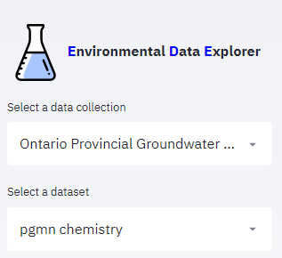
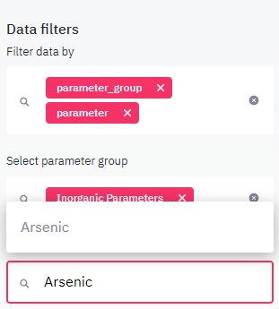

====================
Get Started Tutorial
====================

***************************************
Tutorial 1: Exploring a data collection
***************************************
This tutorial will guide you through the workflow of discovering a data collection using EDE. It is based on the Ontario Provincial Groundwater Monitoring Network (PGMN) data and aims at getting an overview on this data collection. In a second use case describes the steps to take to look specifically at the data for a well of interest.

When opening EDE, PGMN should already be the first item in the listbox, otherwise select it from the data collection list box.

By default, the first menu item `Info`is selected. On the view panel you will find a overview on the data collection comprising an introductary text and a list of links, related to the data. The info gives a summary on what to expect from the selected data collection, for example: how many parmeters were measured, how many stations were sampled, how many years of data are there. For the Provincial Groundwater Monitoring Network (PGMN) data collection you will find the following: an introductionary text, metadata from the owner (Ontario.ca), a list of links with additional information on the data collection and metadata for two datasets included in this collection: water quality (chemistry) data and water levels. 

Clicking on the stations menu item will show specific information on the stations included in the current dataset. You find again the number of all stations in the title above the first data table. The data table holds all information on the stations as well as on the number of samples taken at each station and on the timeframe the sample were collected. The table may be downloaded using the link below the table. You may also enlarge the table using by clicking in the upper right corner of the table. 
Below the table all samples are shown on a map. Below the map, there is an additional link to a googlemap site, showing the same data in a more interactive way and with a high resolution satellite background. Google map also allows to measure distances and add lines and markers.

As PGMN network has a second dataset with water levels, this second dataset can be explored in the same way. The station names are largely identical with the water quality sampling stations explored in the previous step. Nearly all wells are equipped with a piezometer. Wells with names such as W0000114-2/3/4 have multiple pizometer at different depth intervals.

Return to the ede page and click on the parameters menu item. A single page with all parameters having at least one observation in the dataset is shown. The minimum, maximum and average value as well as the number of observations and sampling years are shown. It can be noted, that most organic parameters and pesticides have been sampled only once at most stations. whereas Inorganic parameters where sampled yearly in most cases. In order to focus on specific parameter groups and parameters, you may filter the parameter displayed in the viewport using the data filters on the sideboard. For example to gain more insight in the parameter arsenic, enable both the parameter_group and parameter filter in the data filter select box. the select the parameter group 'inorganic parameters' and from the parmaeter list in the select box below, which now only contains inorganic parameters, type in arsenic or select the parameter from the list.

The viewport now contains again the parameter summary table, however in a transposed format making it easier to read. Below the summary table, an additional table shows the statistical values for each station. At the bottom of the page a map is rendered. Concentrations are rendered in the following colors:

* < 10 percentile: blue
* 10-90 percentile green
* > 90 percentile: red

The map allows to detect spatial patterns. A more detailed analysis can be done using the plotting menu item, explained in tutorial 2 and 3.

**********************************
Tutorial 2: Creating summary plots
**********************************

This second tutorial will guide you through the procedures to compare groundwater composition provided from overburden wells, completed in sand or gravel aquifers or bedrock wells, completed in a solid rock aquifer for example in a sandstone or fractured carbonates aquifer.

****************************************************
Tutorial 3: Creating plot markers and multiple plots
****************************************************

The third