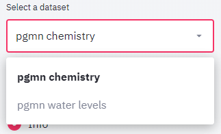
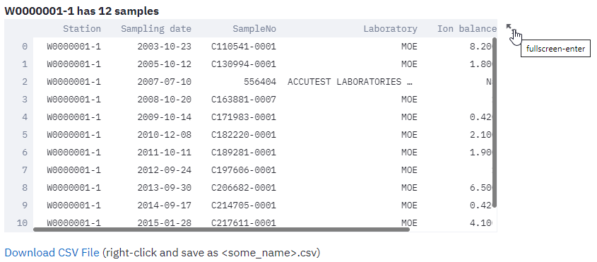

# Main Concepts

## Data collection
A data collection consists of datasets related to each other. For example, The PGMN data collection comprises the datasets chemistry, which is the main dataset, water levels, and precipitation data. A data collection requires a introductory text and a least one dataset.
Data collections can be selected from the `select a data collection` listbox above the menu.

## Data sets
Each datasets consists of three entities:
* a list of stations
* a list of parameters
* a list of observations, each observation (record) having a reference to a station, an observation date, a reference to a parameter and a measured value.

To explore a dataset, the dataset needs to be selected in the selectbox above the menu. If a data collection includes only a single dataset, this dataset is selected by default and no dataset selectbox is shown to the user.

## User interface
The user interface consists of a sidebar on the left side of the brwoser window, holding all controls and menu items, and the view panel where all table and graphics output is generated by the user.

The sidebar is further subdivided from top to down into various sections. Not all sections are shown in all menu contexts. From top to bottom you find:
* The data selection controls: allows to activate a dataset for analyis
* The menu: allows to select what information should be rendered on the viewport
* The plot type (only visible if the `Plotting` menu is active)
* The `Plot and axis settings` (only visible if the `Plotting` menu is active) This section adjusts to the currently selected plot type, for example for scatter diagrams, you will find a X and a Y parameter, for histograms only a Y parameter. 
* The `Data filters` allow to filter the data to only include specific parameters or stations. After filtering, plots and tables will be based on the defined subset of the data.

The view panel is used to display plots and tables requested by the user via the sidebar controls.

### Plots
Plots are created using the `Plotting` menu item. The hamburger menu to the upper right of each plot allows to save or edit the plots. In the plot mode, the sidebar contains a show data option, allowing to show the data used for creating the plot. This data can be downloaded and the user may recreated the plot using his preferred charting software.

### Tables
Tables are generated mainly by the `Parameters info` and `Station info` menu items, however for every plot, the underlying data may also be displayed in the table format. For larger tables use the scrollbars to view the full table content. You may also use the handle in the upper right to open a new window, resulting in displaying a larger version of the table.

Below each table, you will find a link, that allows downloading the table as a csv file. You may either just click on the link and download the file under a default name to your download folder. Right-click the link and select the `save as` command in the context menu, to directly place the file under a specified name in your target folder.

### Data filters
For large datasets, the information to be shown in tables or plots must be filtered, to show a subset of the available data. First select the parameters, that you wish to filter, for example depth category and station name in the example below. For each selected parameter, an additional select box will appear in the data filter section, where you may the values to be filtered for. In the example below, only wells deeper than 150 m will be used for any of the following operations. The station list in the station selectbox is also filtered for deep wells making it easier to find a specific deep well. When looking for specific wells, it is therefore often useful to apply several filters in order to obtain a more manageable list.

