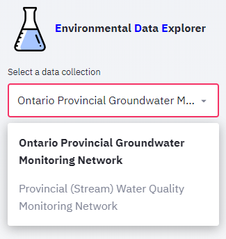

#############
Main Concepts
#############

***************
Data collection
***************
a data collection is a collection of datasets related to each other. The PGMN datacollection consists for example of the datasets chemistry, water levels and precipitation. A data collection requires a introductory text and a least one dataset.
Data collections can be selected from the 'select a data collection' listbox above the menu.

*********
Data sets
*********
Each datasets consist of three tables: 
* a station table
* a parameter table 
* a data table

In order to explore a dataset, it needs to be selected. If a data collection includes only one dataset, for example the Privincial stream water quality monitoring network, this dataset is selected by default. If there are more than one dataset, a listbox is displayed below the data collection listbox where you may select the dataset you wish to explore.

.. image:: _static/1_2.png
   :scale: 60 %
   :align: center

**************
User interface
**************
The user interface is very simple. It is devide in a sideboard holding all controls and menu items and the view panel to the right.

.. image:: _static/1_3.png
   :scale: 70 %
   :align: center

The sideboard is further subdivided from top to down into the data selection controls, the menu, and the controls for generating plots. The latter only appears if the menu item 'plots' is selected.

####
Menu
####
****
Info
****
The information rendered in the view panel holds the following sections: 
* a general description of the dataset
* metadata from the owner
* links to web pages related to the data collection
* summary information for each dataset (number of stations, parmaeters, measurentments etc.)

*******************
Station information
*******************
In this mode, a list of stations appears below the menu where you can select stations, for which all available information should be displayed in the view panel. If a station is selected, the following tables and plots are displayed
* table holds all information on the station (location, name, township etc.)
* map showing position of station
* table listing all samples collected at the station
* table listing summary of samples collected at the station summarized by year

Each table may be downloaded by clicking or rightclicking on the link below the table. If a google map was created with your stations, you may click the link below the the map to open the station locations in [google maps](https://www.google.com/maps/). In google maps you will find a more detailed background map and in many regions on the globe you have the possilbity to virtually visit the location using streetmap. In order to find your well quickly, paste the station name into the search field. Note that the clipboard is automatically filled with the current station name, so it can be pasted directly into the google map search field.

.. image:: _static/1_5.png
   :scale: 40 %
   :align: center

**********************
Parameters information
**********************
In this mode, a selectbox with stations and a selectbox with parameters appear below the menu to you may control for which parameters information should be displayed in the view panel. If on or several stations are selected, the parameter list is filled with parameters that have been analysed for this station. If a parameter is selected, a detail table is displayed with information regarding the parameter. If a parameter is selected the following information is available in the view pane:
* detail table holding information on the parameter
* summary table listing all stations, where parameter was measured including number of measurments, average value, first year of observation, last year of observation
* table listing concentration summary per station for 
* table listing summary of samples collected at the station summarized by year

Plotting
========
The Plotting menu allows you to visualize the data using various charts. 

Histogram
*********

Tables
======
Data is displayed as plots or in tables. For larger tables use the scrollbars to view the full table content. you may also use the handle in the upper right to open a new window showing a larger version of the table.

.. image:: _static/1_4.png
   :scale: 70 %
   :align: center

Below each table, you will find a link, that will download a csv file of the data. You may either just click on the link and download the file under a default name to your download folder. Rightclick the link and select the <save as> command in the context menu, to directly place the file under a specified name in your target folder.