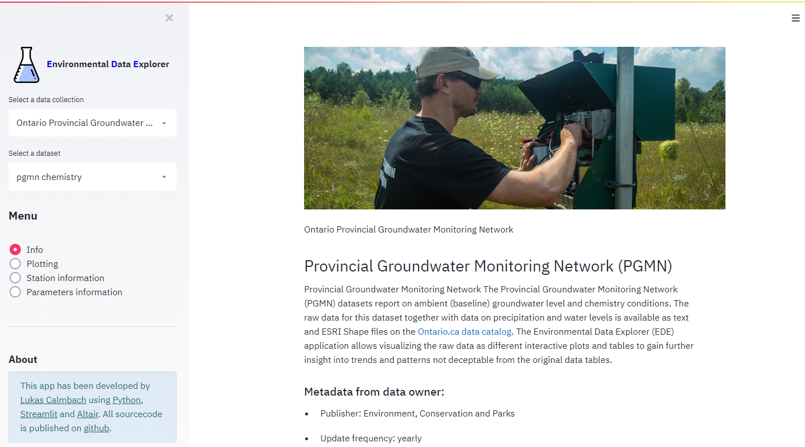

#############
Main Concepts
#############

***************
Data collection
***************
a data collection is a collection of datasets related to each other. The PGMN datacollection consists for example of the datasets chemistry, water levels and precipitation. A data collection requires a introductory text and a least one dataset.
Data collections can be selected from the 'select a data collection' listbox above the menu.

.. image:: _static/1_1.png
   :scale: 70 %
   :align: center

*********
Data sets
*********
Each datasets consist of three tables: 
* a station table
* a parameter table 
* a data table

In order to explore a dataset, it needs to be selected. If a data collection includes only one dataset, for example the Privincial stream water quality monitoring network, this dataset is selected by default. If there are more than one dataset, a listbox is displayed below the data collection listbox where you may select the dataset you wish to explore.

.. image:: _static/1_2.png
   :scale: 60 %
   :align: center

**************
User interface
**************
The user interface is very simple. It is devide in a sideboard holding all controls and menu items and the view panel to the right.

The sideboard is further subdivided from top to down into the data selection controls, the menu, and the controls for generating plots. The latter only appears if the menu item 'plots' is selected.

