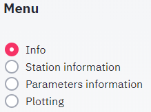

####
Menu
####
This chapter describes the use of each menu item, located on the sideboard:

****
Info
****
The information rendered in the view panel holds the following sections: 
* a general description of the dataset
* metadata from the owner
* links to web pages related to the data collection
* summary information for each dataset (number of stations, parmaeters, measurentments etc.)

*******************
Station information
*******************
In this mode, a list of stations appears below the menu where you can select stations, for which all available information should be displayed in the view panel. If a station is selected, the following tables and plots are displayed
* table holds all information on the station (location, name, township etc.)
* map showing position of station
* table listing all samples collected at the station
* table listing summary of samples collected at the station summarized by year

Each table may be downloaded by clicking or rightclicking on the link below the table. If a google map was created with your stations, you may click the link below the the map to open the station locations in [google maps](https://www.google.com/maps/). In google maps you will find a more detailed background map and in many regions on the globe you have the possilbity to virtually visit the location using streetmap. In order to find your well quickly, paste the station name into the search field. Note that the clipboard is automatically filled with the current station name, so it can be pasted directly into the google map search field.

.. image:: _static/1_5.png
   :scale: 40 %
   :align: center

**********************
Parameters information
**********************
In this mode, a selectbox with stations and a selectbox with parameters appear below the menu to you may control for which parameters information should be displayed in the view panel. If on or several stations are selected, the parameter list is filled with parameters that have been analysed for this station. If a parameter is selected, a detail table is displayed with information regarding the parameter. If a parameter is selected the following information is available in the view pane:

* detail table holding information on the parameter
* summary table listing all stations, where parameter was measured including number of measurments, average value, first year of observation, last year of observation
* table listing concentration summary per station for 
* table listing summary of samples collected at the station summarized by year

********
Plotting
********
The `Plotting` menu allows you to visualize the data using various charts. The following plot types are available:

* Bar chart
* Time series
* Scatter plot
* Box plot
* Histogram

These use of these plots is discussed in detail in `Plots` chapter. Other that the plot type, the plots rendered in the view panel section can be controlled by by the following parameters:

Plot group by
-------------
The `Plot group by` listbox allows to generate a plot for each distinct occurrence of the plot group by parameter in the data. If the data is grouped by the year, all data points sampled in the same year will be included in the same plot and for each year where there is a least one observation, a plot is created. If `plot group by` is set to `none`, only a single plot will be created.

Marker group by
---------------
The `Marker group by` listbox allows to generate a marker for each distinct occurrence of the marker group by parameter in the data. If the data is grouped by the year, all data points sampled in the same year will be be shown as a distinct marker and the legend will include one item for each year, where there is a least one observation in the data. If `marker group by` is set to `none`, only a single marker will be created in the plot.

Filter
------
Data may be filtered prior to generating the plots. Filters are particularly useful for very large datasets. For example, the PGMN water quality dataset comprises over 500 wells. Plotting time series diagrams using the group plot by station option would result in a plot for each station, which will take much time to render in your browser.

Parameters
----------