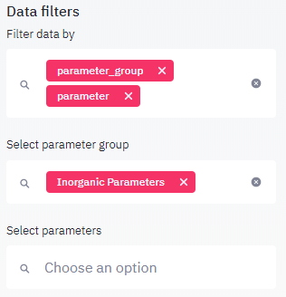
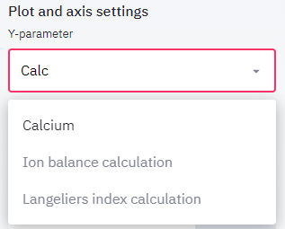
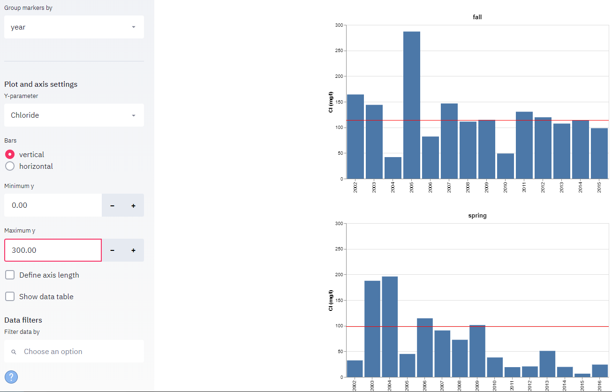

####
Menu
####
This chapter describes the use of each menu item, located on the sidebar:

.. image:: _static/menu_menu.png
   :scale: 71 %
   :align: center

****
Info
****
The information rendered in the view panel holds the following sections: 
* a general description of the dataset
* metadata from the owner
* links to web pages related to the data collection
* summary information for each dataset (number of stations, parmaeters, measurentments etc.)

*******************
Station information
*******************
In this mode, a list of stations appears below the menu where you can select stations, for which all available information should be displayed in the view panel. If a station is selected, the following tables and plots are displayed
* table holds all information on the station (location, name, township etc.)
* map showing position of station
* table listing all samples collected at the station
* table listing summary of samples collected at the station summarized by year

Each table may be downloaded by clicking or rightclicking on the link below the table. If a google map was created with your stations, you may click the link below the the map to open the station locations in `Google Maps <https://www.google.com/maps/>`_. In Google Maps you will find a more detailed background map and in many regions on the globe you have the possilbity to virtually visit the location using streetmap. In order to find your well quickly, paste the station name into the search field. Note that the clipboard is automatically filled with the current station name, so it can be pasted directly into the Google Map search field.

.. image:: _static/1_5.png
   :scale: 40 %
   :align: center

**********************
Parameters information
**********************
When clicking on the *parameters* menu item, a list of all parameters used in this dataset is displayed. The list includes metadata on the parameter and summary information on the observed values in the entire dataset in the last columns. You may use the data filter to limit the parameters shown in the parameter table. It can be filtered by parameter group (general, inorganic, organic, pesticides, radioactive) or by selecting individual parameters.  Combining both searches allows to find parameters more quickly. For example, if a list of inorganic parmaeters needs to be generated, one may first filter for parameter_group = inorganic parameters, then pick specific parameters from the parameter list, which by now only contains inorganic parameters.

If a single parameter is selected, additional information is displayed:

* A detail table holding information on the parameter. Below the table there is a link named 'More information (source: NIH-TOXNET)' which will display additional information on the parameter stored in the U.S. National Library of Medicine.
* A summary table listing all stations, where the parameter was measured including number of measurements, extreme and average value, first and last year of observation
* A map showing average concentrations per station. Values are shown in three colors:
    - blue dots represents values from 0 to 10 percentile
    - green dots represent values from >10 to 90 percentile
    - red dots represent values > 90 percentile

********
Plotting
********
The `Plotting` menu allows you to visualize the data using various charts. The following plot types are available:

* Bar chart
* Time series
* Scatter plot
* Box plot
* Histogram

These use of these plots is discussed in detail in `Plots` chapter. Other that the plot type, the plots rendered in the view panel section can be controlled by by the following parameters:

Group plots by
--------------
The `Group plots by` listbox allows to generate a plot for each distinct occurrence of the selected plot group by parameter in the data. If the data is grouped by the year, all data points sampled in the same year will be included in the same plot and for each year where there is a least one observation, a plot is created. If `plot group by` is set to `none`, only a single plot will be created.

Marker group by
---------------
The `Marker group by` listbox allows to generate a marker for each distinct occurrence of the marker group by parameter in the data. If the data is grouped by the year, all data points sampled in the same year will be be shown as a distinct marker and the legend will include one item for each year, where there is a least one observation in the data. If `marker group by` is set to `none`, only a single marker will be created in the plot.

Filter
------
Data may be filtered prior to generating the plots. Filters are particularly useful for very large datasets. For example, the PGMN water quality dataset comprises over 500 wells. Plotting time series diagrams using the group plot by station option would result in a plot for each station, which will take a long time to render in your browser.

Parameters
----------
All plots require to select at least one parameter. By default, the first parameter in the parameter list is selected. Parameters may be manually selected, or the parameter name may be typed, as in the example below and selected once the list of parameters is shorter and more manageable.

Axis
----
By default, the axis minimum and maximum values are selected automatically in order to show all available data. When generating multiple plots using the plot group by function, it is often desireable to use the same axis extension so the plots are easier to compare. This can be achieved by using the x axis and y axis minimum and maximum fields as shown below. The x axis is only available for scatter plots and time series, since for the other plots, the x axis is controlled by the marker group by setting.

The 'Define axis length' fields allow to define the lengths of axes in pixels (1 px = 0.026458333 cm for a standard pixel density of 96 dpi or 96 px/inch. Depending on the plot type, plot axes may be adapted to allow. The example below shows how shortening the y axis for time series diagrams allows to include more graphs in the viewport.

Show data table
---------------
The show data table option results in including a table with all data shown below every plot. This table can be downloaded using the download link below the table. 

Data filters
------------
Data filters allow limiting the data used to generate the graphs. The first selectbox is used to define, which data columns should be used for filtering the data, in the following selectboxes, these filters can then be defined.
